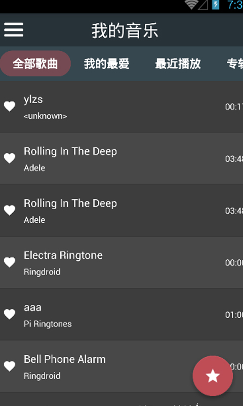
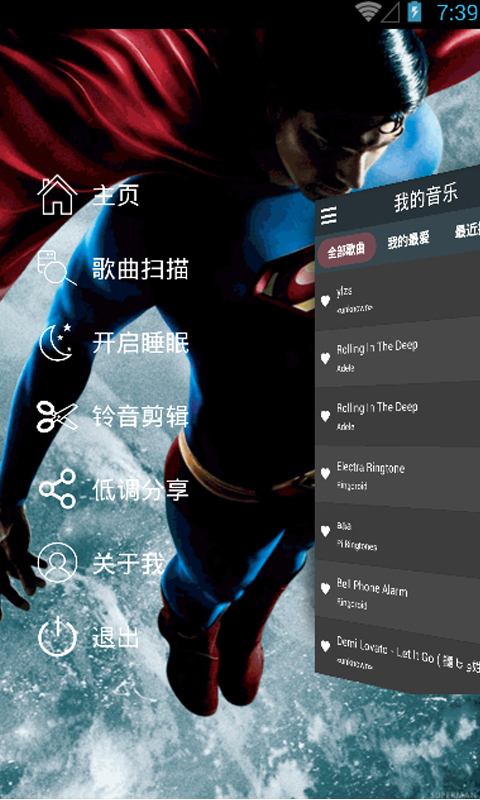

# SupermanMusicPlayer

##简介
> 一款本地音乐播放器源码, 已实现的功能如下:

* 播放音乐
* 上一曲
* 下一曲
* 歌词和专辑图片的显示
* 添加歌曲到我的最爱
* 最近播放列表
* 专辑唱片列表
* 开启睡眠定时
* 铃音剪辑
* 第三方分享

##播放器截图展示

* 播放器的splash界面

* 音乐列表界面

* 炫酷的侧滑菜单

* 歌曲扫描界面

* 正在播放界面, 可显示歌词和专辑图片, 背景为专辑图片的模糊显示 

* 剪辑音乐界面, 可任意剪辑歌曲, 将剪辑后的歌曲片段作为铃声

