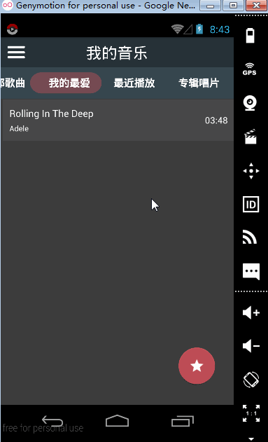
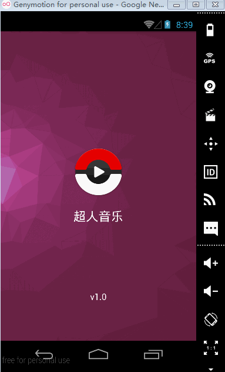
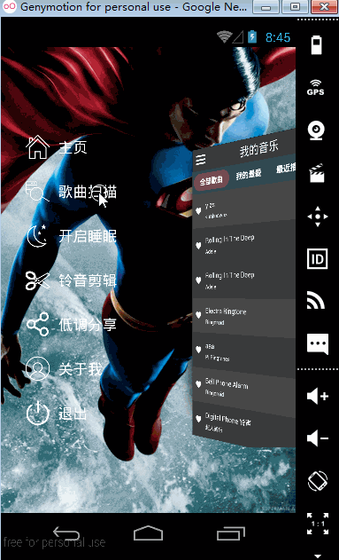
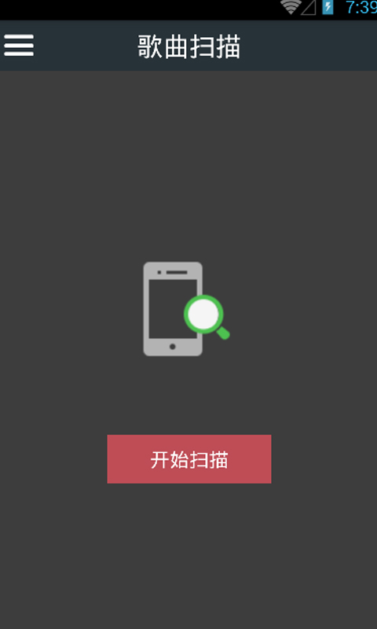
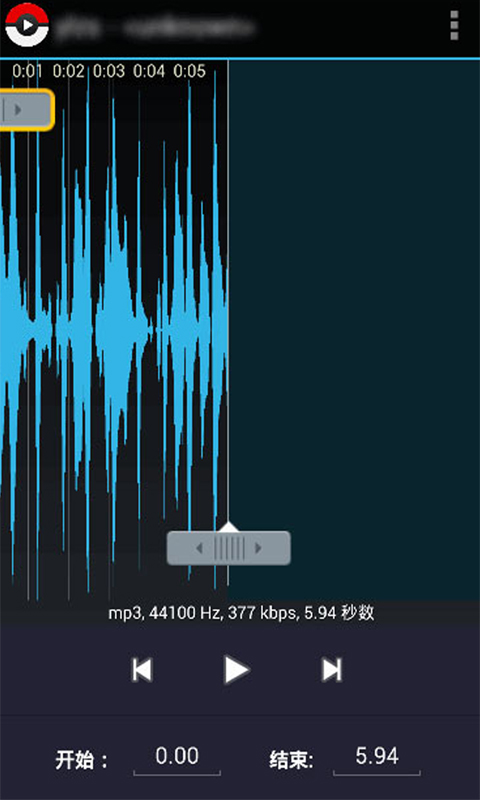

# SupermanMusicPlayer

##简介
> 一款本地音乐播放器源码, 已实现的功能如下:

* 播放音乐
* 上一曲
* 下一曲
* 播放模式切换(随机、顺序、列表循环、单曲循环)
* 歌词和专辑图片的显示
* 添加歌曲到我的最爱
* 最近播放列表
* 专辑唱片列表
* 开启睡眠定时
* 铃音剪辑
* 第三方分享

##使用到的开源框架

* AndroidResideMenu-master ---> 侧滑菜单
* Picasso ---> 加载专辑图片
* AppIntro ---> 引导界面
* SmartTabLayout ---> 主界面顶部页签
* discrollview ---> 关于我
* ringdroid ---> 铃音剪辑
* acra-master ---> 异常退出
* NativeStackBlur ---> 正在播放界面背景高斯模糊
* ShareSDK ---> 第三方分享

##应用市场中下载示例程序

* 豌豆荚
	* [http://www.wandoujia.com/apps/why.supermanmusic](http://www.wandoujia.com/apps/why.supermanmusic)
* 腾讯应用宝
	* [http://android.myapp.com/myapp/detail.htm?apkName=why.supermanmusic](http://android.myapp.com/myapp/detail.htm?apkName=why.supermanmusic)
* 百度手机助手
	* [http://shouji.baidu.com/software/9583485.html](http://shouji.baidu.com/software/9583485.html)
* 安卓市场
	* [http://apk.hiapk.com/appinfo/why.supermanmusic](http://apk.hiapk.com/appinfo/why.supermanmusic)
* 安智官网
	* [http://www.anzhi.com/soft_2630997.html](http://www.anzhi.com/soft_2630997.html)

##播放器截图

* 主界面

* 播放音乐

* 侧滑菜单

* 歌曲扫描界面

* 正在播放界面, 可显示歌词和专辑图片, 背景为专辑图片的模糊显示 

* 剪辑音乐界面, 可任意剪辑歌曲, 将剪辑后的歌曲片段作为铃声

##关于我

* github: 
	* [https://github.com/tedhappy](https://github.com/tedhappy "https://github.com/tedhappy")
* CSDN: 
	* [http://blog.csdn.net/wanghaoyuhappy](http://blog.csdn.net/wanghaoyuhappy "http://blog.csdn.net/wanghaoyuhappy")
* 博客园
	* [http://www.cnblogs.com/wanghaoyuhappy](http://www.cnblogs.com/wanghaoyuhappy "http://www.cnblogs.com/wanghaoyuhappy")

##联系我

* Email: <why0229@foxmail.com>

##微信公众号

* 程序员的笔记(coder_notes)

